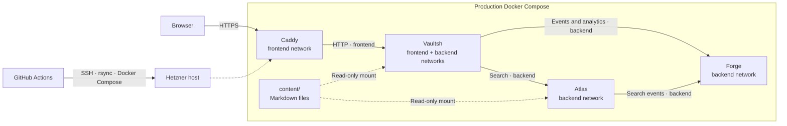

# Backend Lab

Local orchestration and shared content for Vaultsh, Atlas, and Forge, with
advisory release analysis from Sentinel.

Each application repository owns its source code, tests, dependencies, and
Dockerfile. Lab owns shared configuration, content, and Docker Compose
orchestration only.

## Architecture



- Caddy is the only internet-facing container.
- Vaultsh owns the user experience and degrades gracefully when Atlas or Forge
  is unavailable.
- Atlas and Forge are reachable only through the internal backend network.
- Vaultsh and Atlas consume the same read-only content.

## Testing

| Layer | Coverage |
| --- | --- |
| Vaultsh unit tests | Tokenizer, lexer, parser, commands, virtual filesystem, sessions, completion, HTTP limits, and telemetry dispatch |
| Atlas unit and integration tests | Search behavior, HTTP controller, health endpoint, authentication, and telemetry dispatch |
| Forge unit and API tests | Event validation, aggregation, filtering, authentication, health, summaries, and dashboard rendering |
| Container tests | Every service image builds and runs its test suite before producing the runtime image |
| Deployment verification | Compose waits for service health checks, then CI verifies the public HTTPS health endpoint |

Tests run in each service repository's CI workflow. Production deployment runs
only from Lab, pulls service images pinned by Git SHA, and publishes sanitized
per-service deployment status to Vaultsh.

## Prerequisites

Install Docker Engine or Docker Desktop with Docker Compose v2. Clone `lab`,
`vaultsh`, `atlas`, and `forge` as sibling directories.

## Run

```sh
docker compose up --build
```

Services:

- Vaultsh: http://localhost:8080
- Atlas: private Compose network only
- Forge: private Compose network only

Stop the stack:

```sh
docker compose down
```

To get a temporary public URL for the local app:

```sh
docker run --rm cloudflare/cloudflared:latest tunnel --url http://host.docker.internal:8080
```

Open the `trycloudflare.com` URL printed by the command.

## Production

Pushes to `main` deploy to [mateolabs.dev](https://mateolabs.dev) through
GitHub Actions. To access the server:

```sh
ssh -i <private-key> deploy@<server-ip>
```

See the [deployment guide](content/docs/deployment.md) for the server layout,
security controls, and manual recovery commands.

## Logs

All services write logs to container stdout. Docker rotates each service's
local JSON logs at 10 MB and retains three files.

```sh
docker compose logs --tail=100
docker compose logs -f forge
docker compose logs -f vault atlas
```

Logs are local operational output, not Forge telemetry. Forge keeps aggregated
telemetry counters in memory and does not store application logs.

## Configuration

Copy `.env.example` to `.env`, then generate independent service tokens:

```sh
openssl rand -hex 32
openssl rand -hex 32
```

Set the results as `ATLAS_AUTH_TOKEN` and `FORGE_AUTH_TOKEN`. Compose refuses
to start when either token is missing. Do not commit `.env`.

In local Compose, only Vaultsh publishes a host port. In production, only
Caddy publishes host ports. Atlas and Forge are reachable exclusively through
the private backend network and require bearer authentication on all
non-health endpoints.

[`sentinel.yml`](sentinel.yml) defines the release policy. Sentinel currently
runs change-selected deterministic checks, service-contract and degradation
checks, centralized evidence redaction, and mock analysis in advisory mode.

## Shared content

`content/` is the single source of truth. Compose mounts it into Vaultsh and
Atlas at `/app/content` read-only. Vaultsh loads it as its virtual filesystem,
and Atlas scans it for search requests.

## Documentation

Shared documentation lives under `content/docs/`. Start with the
[architecture overview](content/docs/architecture/overview.md) or
[event catalog](content/docs/events.md). Vaultsh, Atlas, Forge, and Sentinel
have concise service documents under
[`content/docs/architecture/`](content/docs/architecture/).
