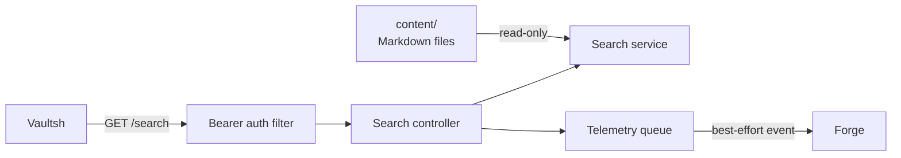

# Atlas Architecture

Atlas is an authenticated, read-only search service for the shared portfolio
content. It performs a recursive case-insensitive line scan on every request.

## Components

- **Authentication filter:** Protects `/search` with a service bearer token.
- **Search controller:** Validates the query and records request telemetry.
- **Search service:** Walks regular files in deterministic path order and scans
  UTF-8 text line by line.
- **Telemetry dispatcher:** Delivers events to Forge from a bounded in-process
  queue.
- **Status endpoint:** Reports process health and uptime for the Vaultsh
  dashboard.

## Search Flow

Atlas lowercases the query and each input line using a locale-independent
comparison. Every matching result contains the virtual path, line number, and
original raw Markdown line. Atlas does not render Markdown, build an index, or
rank results.

## State and Failure Behavior

Atlas keeps no search index, cache, database, or user session. The content
mount is its source of truth.

- A missing content directory returns an empty result set.
- A file traversal or read failure fails the search request.
- Telemetry delivery failure does not fail search.
- Restarting Atlas loses no application data.

## Design Decisions

- Use linear scanning while the content set is small.
- Return source lines so search results match `grep` and `cat`.
- Keep content shared with Vaultsh rather than maintaining a second copy.
- Defer indexing, ranking, and persistence until scale justifies them.
