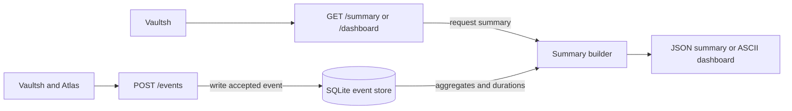

# Forge Architecture

Forge receives authenticated telemetry, stores bounded event records in
SQLite, and exposes filtered JSON summaries and terminal-friendly dashboards.

## Components

- **Event endpoint:** validates bounded event fields and adds a server-generated
  UTC timestamp.
- **SQLite store:** applies ordered migrations, WAL mode, retention, and
  database-size limits.
- **Summary builder:** requests time-windowed SQL aggregates and durations,
  then assembles p50 and p95 backend command time plus storage metadata.
- **Dashboard renderer:** converts a summary into plain text and proportional
  bars.

The health endpoint is public inside the private Compose network. Other
endpoints require the Forge service token.

## Data model

Each stored event contains only its UTC recording timestamp, producer service,
event type, command or operation name, duration, and exit code. String fields
have strict length and character limits. Unknown request fields are rejected.
Forge does not accept IP addresses, tokens, request bodies, or command
arguments.

## Storage lifecycle

Migrations run in numeric order at startup. File-backed databases use WAL mode
with a five-second busy timeout. Compose mounts `/app/data` from the
`forge_data` volume.

`FORGE_RETENTION_DAYS` removes expired rows. If the database and WAL exceed
`FORGE_MAX_DATABASE_BYTES`, Forge deletes the oldest rows in bounded batches
and compacts the database. Defaults are 30 days and 128 MiB.

## Failure behavior

- Invalid events are rejected without changing storage.
- One process lock serializes connection access.
- Producer queues remain best-effort; events can be lost before Forge accepts
  them.
- Accepted events survive Forge restarts and deployments.
- Forge unavailability does not block Vaultsh commands or Atlas searches.

## Decisions

- Keep persistence inside Forge rather than adding a storage service.
- Retain bounded sanitized events so summaries can be rebuilt.
- Use SQLite because production runs one Forge instance.
- Render plain text so Vaultsh needs no second analytics UI.
