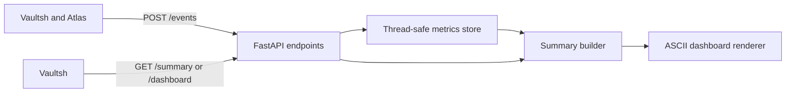

# Forge Architecture

Forge receives service telemetry, aggregates it in memory, and exposes JSON
summaries and terminal-friendly dashboards.

## Components

- **Event endpoint:** Validates and records authenticated telemetry events.
- **Metrics store:** Aggregates counts and durations by service, event, and
  command name under a lock.
- **Summary endpoint:** Filters aggregates and returns JSON.
- **Dashboard renderer:** Converts a summary into plain text and proportional
  bars.

The health endpoint is public inside the private Compose network. Event,
summary, and dashboard endpoints require the Forge service token.

## Data Model

Each event contains:

- Producer service
- Event type
- Command or operation name
- Duration in milliseconds
- Exit code

Forge stores counters and total duration for each event key. It retains at most
2,048 recent duration samples per key for median calculation. It does not store
raw requests, command arguments, tokens, or client addresses.

## State and Failure Behavior

All aggregates are process-local and reset when Forge restarts. There is no
database, queue broker, or replication.

- Invalid events are rejected without changing metrics.
- Concurrent reads and writes are protected by one lock.
- Producer queues decouple request latency; events are lost when a queue is
  full or delivery fails.
- Forge unavailability does not block Vaultsh commands or Atlas searches.
- Dashboard and metrics commands report degraded availability when Forge
  cannot be reached.

## Design Decisions

- Aggregate immediately instead of retaining raw telemetry.
- Keep telemetry best-effort because it is operational context, not business
  data.
- Render plain text so Vaultsh can display the dashboard without a second UI.
- Accept reset-on-restart behavior until historical analytics are required.
