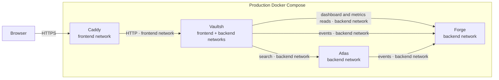
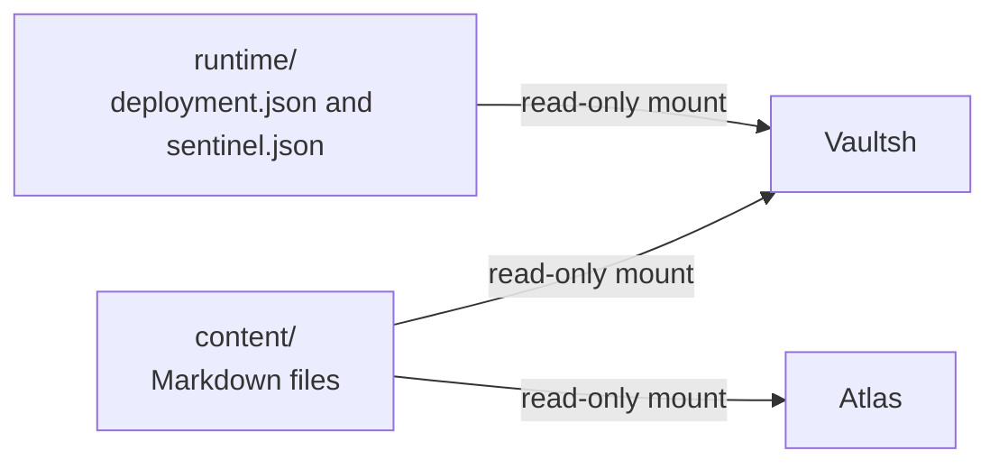
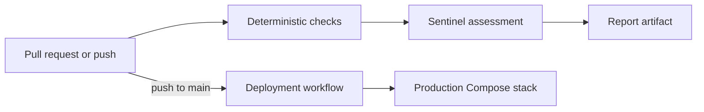

# Backend Lab Architecture

Backend Lab consists of three application services, a production reverse
proxy, one CI/CD analysis tool, and one orchestration repository.

## System Context



Vaultsh is dual-homed. Caddy can reach it through the frontend network, while
Vaultsh reaches Atlas and Forge through the internal backend network.

## Read-only Mounts



These boxes represent host directories and files, not databases. Forge has no
content or runtime metadata mount; it receives events over HTTP and keeps its
aggregates in memory.

## Projects

Service internals are documented separately:

- [Vaultsh architecture](vaultsh.md)
- [Atlas architecture](atlas.md)
- [Forge architecture](forge.md)
- [Sentinel architecture](sentinel.md)

### Vaultsh

Vaultsh is a read-only virtual shell engine.

Responsibilities:

- Virtual filesystem
- Shell engine
- Session management
- Command execution
- Parser
- Pipelines
- Terminal API

Vaultsh owns the user experience. It does not own search or telemetry logic.

### Atlas

Atlas searches the shared content.

Responsibilities:

- Read UTF-8 Markdown documents from shared storage
- Search documents
- Return matching files and lines

Atlas reads the shared content mounted by the Backend Lab.

### Forge

Forge is the portfolio's telemetry analytics and event-processing service.

Responsibilities:

- Receive events from backend services
- Aggregate metrics
- Produce operational summaries
- Render terminal-friendly ASCII dashboards

### Sentinel

Sentinel is a CI/CD release guardian. It analyzes changes and
deterministic check results, applies release policy, and produces
evidence-based reports. It runs before deployment in GitHub Actions and is not
part of the runtime Docker Compose stack.

## Communication

Vaultsh calls Atlas for search and Forge for analytics reads. Vaultsh and Atlas
enqueue telemetry in bounded in-process queues. Background
workers deliver it to Forge over HTTP. Delivery is best-effort and uses no
external message broker.

Release analysis uses a separate control path:



Sentinel runs deterministic checks and produces an advisory assessment. On
pushes to `main`, Sentinel publishes sanitized assessment metadata, while the
separate deployment workflow publishes deployment metadata and updates the
production Compose stack. Pull-request runs publish report artifacts only.
Sentinel does not currently gate deployment.

## External Services

Vaultsh can integrate with optional backend services.

Defined integration targets:

- Atlas — recursive line search
- Forge — telemetry and metrics

Integrations are optional. If an external service is unavailable, Vaultsh
continues functioning with degraded capabilities rather than failing unrelated
command execution.

## Shared Content

The Lab repository owns the single shared content directory:

```text
lab/
└── content/
    ├── cv/
    ├── projects/
    └── docs/
```

Vaultsh mounts this directory as its virtual filesystem. Atlas searches the
same raw Markdown files. Content must never be duplicated between service
repositories.

## User Experience

Vaultsh exposes friendly shell commands:

```text
search kafka
metrics
dashboard
```

Internally, these commands call Atlas and Forge over HTTP. Direct API access
remains available for debugging:

```sh
docker compose exec vault wget -qO- \
  --header="Authorization: Bearer $ATLAS_AUTH_TOKEN" \
  "http://atlas:8080/search?q=kafka"
docker compose exec vault wget -qO- http://atlas:8080/healthz
docker compose exec vault wget -qO- \
  --header="Authorization: Bearer $FORGE_AUTH_TOKEN" \
  http://forge:8080/summary
```

Commands are the product interface. HTTP requests are the debugging interface.

In local development, Vaultsh publishes a host port. In production, only Caddy
publishes host ports; Vaultsh is reachable from Caddy on the frontend network,
while Atlas and Forge are private to the internal backend network. Atlas and
Forge require independent bearer service tokens for non-health endpoints.

## Design Principles

- Small, focused services
- One responsibility per project
- Docker-first
- HTTP-first
- Standard library where practical
- Independent repositories
- Shared content
- Incremental complexity
- Avoid unnecessary abstractions

## Repository Layout

```text
backend-lab/
├── vaultsh/
├── atlas/
├── forge/
└── lab/
```

Each service repository owns its source code, tests, dependencies, and
Dockerfile. Lab owns Docker Compose, environment configuration, shared content,
and local orchestration.

Sentinel owns CI analysis code. Lab owns its Backend Lab policy and shared
architecture, configuration, and roadmap documentation.

## Local Logs

Application services write operational logs to container stdout. Lab configures Docker's
`json-file` driver with a 10 MB maximum file size and three retained files per
service. Logs remain separate from Forge telemetry and can be inspected with
`docker compose logs`.

## Production Boundary

The production stack connects Caddy only to the frontend network. Vaultsh joins
both frontend and backend networks but has no published host port. Atlas and
Forge join only the internal backend network.

Caddy owns HTTPS certificate management. Vaultsh owns API rate limits, request
and command size limits, active-session capacity, and HTTP timeouts. Compose
applies container resource and privilege restrictions.
