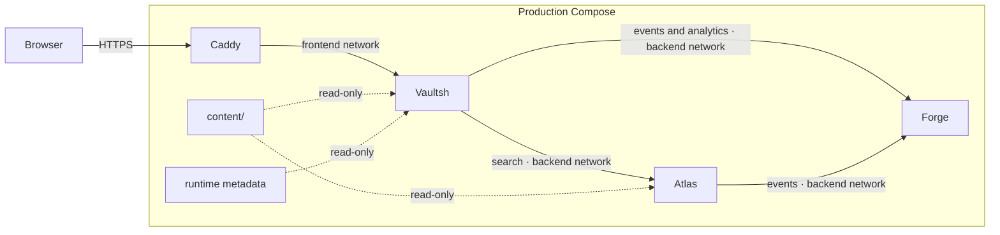

# Backend Lab Architecture

This document defines system boundaries and communication. Service internals
are documented in the linked architecture documents.

## Runtime topology

Caddy is the only internet-facing container. Vaultsh joins the frontend and
backend networks; Atlas and Forge join only the backend network. Independent
bearer tokens protect service APIs. Health and status probes are public only
inside the private Compose networks.

## Component ownership

- **Vaultsh** owns the browser terminal, HTTP entry point, sessions, shell
  execution, and virtual filesystem.
- **Atlas** owns search over the shared Markdown content.
- **Forge** owns telemetry ingestion, aggregation, and text dashboards.
- **Sentinel** is a CI tool that evaluates deterministic evidence
  and release policy. It is not a runtime service.
- **Lab** owns orchestration, deployment, shared content, runtime metadata,
  and project-specific Sentinel policy.

Internals: [Vaultsh](vaultsh.md), [Atlas](atlas.md), [Forge](forge.md), and
[Sentinel](sentinel.md).

## Data and communication

`lab/content/` is the only content source. Vaultsh loads it into an in-memory
virtual filesystem; Atlas scans the same files. Neither service writes it.

Vaultsh calls Atlas synchronously for search and Forge synchronously for
analytics reads. Vaultsh and Atlas send events through bounded in-process
queues, so telemetry failure or queue saturation never blocks user requests.
There is no message broker.

Deployment and sanitized Sentinel results are CI-produced JSON files mounted 
into Vaultsh. Forge stores bounded telemetry events in SQLite database.

## Failure boundaries

- Atlas failure disables search only.
- Forge failure disables analytics and loses undelivered telemetry.
- Vaultsh restart discards sessions.
- Accepted Forge events survive restarts; producer queues can still lose
  events before delivery.
- Provider or CI failure does not affect the last deployed runtime.

The system deliberately favors graceful degradation and replaceable
process-local state over distributed coordination.

## Repository boundaries

Each application repository owns its source, tests, dependencies, and
Dockerfile. Lab owns Compose, Caddy, shared content, environment configuration,
release policy, and deployment workflows. Application logs go to container
stdout and are distinct from Forge telemetry.
