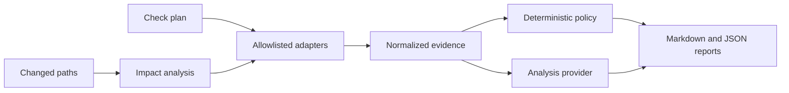

# Sentinel Architecture

Sentinel is an ephemeral CI CLI. It consumes configuration, changed paths, and
machine-readable check results; it is not part of the production Compose
runtime.

## Flow

## Components

- **Impact analyzer:** maps changed paths to repositories, services, and check
  groups using Lab's versioned rules.
- **Check adapters:** execute or import regression, security, build, contract,
  and deployment results into one bounded evidence contract.
- **Policy engine:** makes deterministic release decisions independently of
  model output.
- **Analysis provider:** explains evidence. The current provider is a mock;
  production LLM analysis remains planned.
- **Reporter:** separates facts, policy decisions, and inferences in CI
  artifacts, pull-request comments, and sanitized runtime metadata.

## Trust boundary

Repository files and tool output are untrusted. Command checks use argument
arrays rather than shell strings, allowlisted executables, workspace-confined
directories, timeouts, and bounded retained output. Central redaction removes
common credentials and configured secrets before evidence is stored.

Raw scanner reports and secret values are never included in public runtime
metadata. Analysis providers cannot override check outcomes, write
repositories, or deploy.

## Ownership and state

Sentinel owns the CLI, normalized evidence model, adapters, policy engine, and
reporters. Lab owns Backend Lab's `sentinel.yml`, impact rules, and workflow
integration. Sentinel stores no database.

The current Lab policy is advisory. In non-advisory mode, blocked and
approval-required decisions produce a non-zero exit code; promotion to that
mode requires a proven check set and protected approval workflow.
