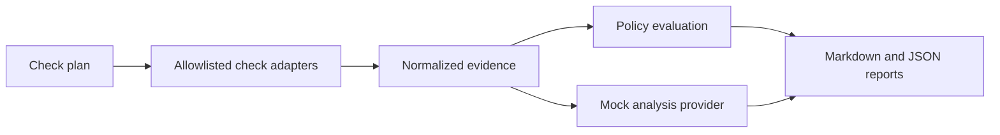

# Sentinel Architecture

Sentinel runs in CI and consumes repository configuration, Git diffs, and
machine-readable check results. It is not a runtime Backend Lab service.

## Components

### Check Runner

Executes deterministic regression, security, build, and deployment checks.
Every check produces a status, structured evidence, and logs.

Checks use adapters that convert tool-specific output into one normalized
result contract. Adding a scanner or test suite should require a new adapter,
not changes to policy, agent, or reporting code.

The command adapter accepts argument arrays rather than shell strings, allows
only approved executables, confines working directories to the CI workspace,
limits execution time, and retains only a bounded failure-output tail.
Additional adapters normalize GitHub Actions outcomes and verify required or
forbidden configuration markers.

Backend Lab runs containerized tests, Compose validation, repository secret and
dependency scanning, container-image scanning, security-header policy, and
internal-network policy. Third-party scanner actions are pinned to full commit
SHAs. Detailed scanner output is not published to the public dashboard.
The public assessment contains bounded counts, vulnerability identifiers,
package names, installed and fixed versions, and deterministic remediation
actions. Secret values and raw scanner reports are deleted before artifacts
are published.

### Policy Engine

Applies explicit rules to deterministic results and does not depend on an LLM
response. The current Backend Lab policy is advisory. In non-advisory mode,
blocked and approval-required decisions cause the CLI to return a non-zero
exit code.

### Analysis Provider

The current mock provider summarizes check outcomes. A production provider
that explains failures, identifies missing coverage, and cites evidence is
planned but not implemented.

### Reporter

Produces Markdown and JSON reports. Reports distinguish facts, policy
decisions, and agent inferences.

On `main`, CI also publishes a reduced assessment containing risk, check
statuses, provider, commit, timestamp, and summary. Vaultsh reads this file
through Lab's existing read-only runtime mount and shows the last assessment
without treating Sentinel as an online service.

## Flow

Change-aware repository analysis, production LLM analysis, pull-request
comments, and approval workflows remain roadmap items.

## Trust Boundary

Repository files and command output are untrusted input. Sentinel executes only
configured allowlisted commands, passes arguments without a shell, confines
working directories to the workspace, and bounds retained output. Backend
Lab's workflow reduces scanner findings before publication and does not expose
raw scanner reports in runtime metadata.

## Decisions

- Deterministic evidence and policy are the authoritative product core.
- Check adapters are extensible; policy depends only on normalized results.
- Analysis providers explain evidence and context but never decide check
  outcomes.
- Sentinel runs as an ephemeral CI CLI and stores no database initially.
- Repository writes and deployments require separate human-controlled tooling.

Backend Lab owns the versioned policy in `lab/sentinel.yml`. Unknown or missing
required fields will fail validation, agent capabilities are advisory, and
secrets must come from CI rather than YAML.

The current policy uses `advisory_only: true`. Changing it to `false` makes
blocked and approval-required decisions fail the Sentinel CI step; this switch
will remain advisory until the check set is proven stable.
