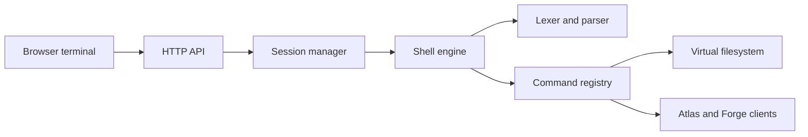
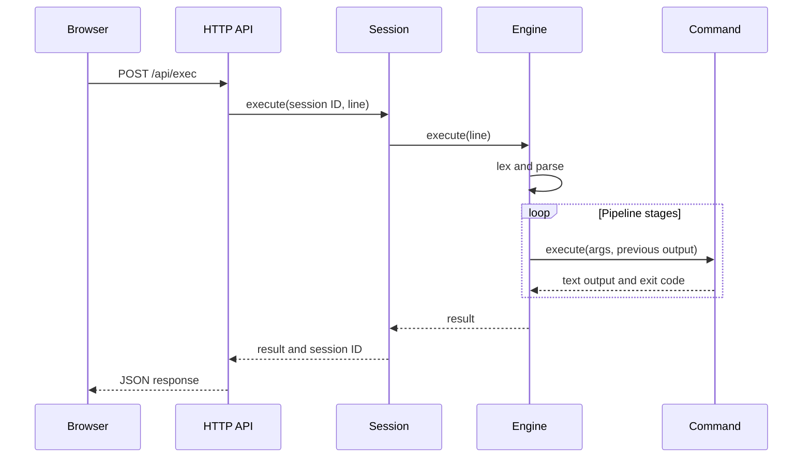

# Vaultsh Architecture

Vaultsh is the public application and shell engine. It serves the browser
terminal, executes commands against a read-only virtual filesystem, maintains
session state, and coordinates optional backend services.

## Components

- **HTTP API:** Serves static assets, command execution, completion, health,
  and service status endpoints.
- **Session manager:** Creates bounded, expiring in-memory sessions and
  serializes operations within each session.
- **Shell engine:** Parses a command line and executes pipeline stages in
  sequence.
- **Command registry:** Maps command names to built-in implementations.
- **Virtual filesystem:** Holds an in-memory, read-only representation of the
  mounted Markdown content.
- **External clients:** Call Atlas for search and Forge for analytics.
- **Telemetry dispatcher:** Sends command events to Forge through a bounded
  background queue.

## Command Flow

Pipeline output is passed between commands as text. Execution stops when a
stage returns a non-zero exit code. Vaultsh never invokes host shell commands.

## State

Vaultsh keeps the following state in memory:

- Session working directory
- Command history
- Offer negotiation state
- Session activity timestamps
- The virtual filesystem loaded at startup

Sessions expire after inactivity and are not shared between replicas. Runtime
deployment and Sentinel metadata remain external JSON files and are read when
requested.

## Failure Behavior

- Atlas or Forge failure does not prevent local shell commands from running.
- Failed pipeline stages stop the remaining stages.
- Telemetry is best-effort; a full queue or failed delivery does not block a
  command response.
- Missing or invalid runtime metadata affects only the related dashboard
  section or command.
- Restarting Vaultsh discards all sessions.

## Design Decisions

- Use a virtual filesystem instead of exposing the host filesystem.
- Keep command execution in-process and deterministic.
- Keep sessions local while production runs a single Vaultsh replica.
- Inject optional integrations so the core shell remains usable without them.
- Return plain text so Unix-like commands compose without a rendering layer.
