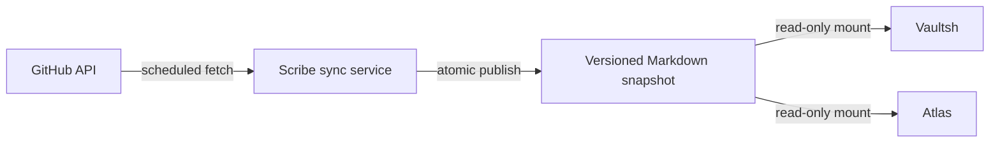

# Scribe Roadmap

**Status:** Proposal

## Purpose

Provide a cached, read-only virtual filesystem generated from source-hosting
providers. Vaultsh exposes the generated Markdown through normal shell
commands, while Atlas indexes the same snapshot for search.

This should be a standalone synchronization service, not a Vaultsh module.
Vaultsh must not own provider credentials, polling, rate-limit handling, or
cache writes.

## Proposed Boundary



- **Sync service:** Fetches, validates, normalizes, and caches provider data.
- **Snapshot:** Contains generated Markdown and a machine-readable manifest.
- **Vaultsh:** Browses the snapshot through the existing virtual filesystem.
- **Atlas:** Searches the raw Markdown without provider-specific behavior.

Provider failures must not affect Vaultsh or Atlas. They continue serving the
last successful snapshot.

## Filesystem Proposal

Use a provider namespace so GitLab and Bitbucket can be added without changing
existing paths:

```text
/source/
└── github/
    ├── profile.md
    ├── activity.md
    └── repos/
        ├── vaultsh/
        │   ├── README.md
        │   ├── metadata.md
        │   ├── commits.md
        │   ├── branches.md
        │   └── releases.md
        └── atlas/
            └── ...
```

Repository directories scale better than one large file and leave room for
additional resource types. Commit and activity history must be bounded rather
than mirrored indefinitely.

## Shell Experience

Existing commands operate on the generated raw Markdown:

```sh
ls /source/github/repos
tree /source/github
cat /source/github/repos/vaultsh/metadata.md
grep Docker /source/github/repos/vaultsh/metadata.md
head /source/github/repos/vaultsh/commits.md
search "Go"
```

Document-to-PDF behavior belongs to Vaultsh's document-export roadmap. The
command name remains undecided; `pdf <path.md>` is clearer than `export`
because POSIX shells already use `export` for environment variables.

## Phase 1: GitHub Snapshot

- [ ] Finalize the project and mount names
- [ ] Define a provider-independent domain model
- [ ] Authenticate to GitHub with a least-privilege token
- [ ] Fetch profile and repository metadata
- [ ] Fetch bounded recent activity, commits, branches, and releases
- [ ] Normalize provider data into deterministic Markdown
- [ ] Write a manifest with provider, account, schema version, and fetch time
- [ ] Publish snapshots atomically so readers never observe partial updates
- [ ] Retain the last successful snapshot when synchronization fails

## Phase 2: Scheduling and Operations

- [ ] Run synchronization on startup and at a configurable interval
- [ ] Respect provider rate-limit and conditional-request headers
- [ ] Add request timeouts, bounded retries, and exponential backoff
- [ ] Expose health and last-successful-sync status
- [ ] Record structured logs without tokens or private repository data
- [ ] Bound snapshot size, repository count, and history depth
- [ ] Add manual refresh for operators without exposing it to shell users

## Phase 3: Backend Lab Integration

- [ ] Mount the published snapshot read-only into Vaultsh
- [ ] Mount the same snapshot read-only into Atlas
- [ ] Add an atomic Vaultsh reload mechanism so published snapshots become
      visible without restarting the service
- [ ] Add `/source` to the virtual filesystem without changing shell commands
- [ ] Verify `cat`, `grep`, `head`, `tail`, and `wc` use raw Markdown
- [ ] Verify Atlas search results use stable virtual paths
- [ ] Surface snapshot age without making provider availability a runtime
      dependency
- [ ] Add Compose health checks and resource limits

## Phase 4: Additional Providers

- [ ] Extract a provider adapter interface after the GitHub model is stable
- [ ] Evaluate GitLab support
- [ ] Evaluate Bitbucket support
- [ ] Keep provider-specific fields namespaced in the snapshot manifest
- [ ] Preserve stable cross-provider filesystem conventions

## Security and Data Rules

- [ ] Treat all provider content as untrusted data
- [ ] Never execute repository content, hooks, or generated instructions
- [ ] Do not clone repositories for the initial version
- [ ] Block private repositories by default
- [ ] Prevent tokens, email addresses, and sensitive metadata from entering
      generated files or logs
- [ ] Escape or normalize content that could corrupt generated Markdown
- [ ] Use a dedicated writable cache; keep Vaultsh and Atlas mounts read-only
- [ ] Validate every generated path and reject traversal or name collisions

## Explicitly Deferred

- Live provider calls during shell commands
- Full Git repository mirroring
- Arbitrary user accounts
- Write operations against providers
- Webhook-driven synchronization
- Unbounded commit or activity history
- Rendering Markdown inside `cat`

## Open Decisions

- Final product and repository name
- Cache ownership: local volume, host directory, or object storage
- Snapshot retention and rollback policy
- Public-only versus explicitly allowlisted private repositories
- Poll interval and history limits
- Whether repository README content belongs in the first version
